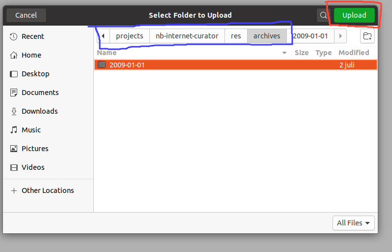

# Brukersteg :open_book:
- Deaktiver alle “adblockers” i nettleseren din eller hvitelist localhost:8080
- Start programmet med å kjøre ``python /*path to program*/main.py ``
- Gå til din pywb instans i nettleseren (localhost:8080)
- Første gangen vil siden være tom for det meste
- Klikk på "Choose archive folder" knappen

- Naviger til din arkivmappe og velg Last opp på arkivmappen din ønsker å jobber med. Det er viktig at stien til arkivet du velger matcher med stien som er definert som “arc_source_directory” i config filen din. Hvis den ikke gjør det vil operasjonen mislykkes. 

   
   

 
- Etter at du har valgt et arkiv, så burde du se en blå melding som informerer om at arkiv lastes inn. Når meldingen forsvinner skal det kommer opp en ny samling i listen under “Collections:”. Hvis det ikke gjør det kan du prøve å laste siden på nytt (f5).
- Med mindre du har fått noe feilmeldinger så burde du se et nytt arkiv i sammlingslisten. Trykk på den.  
- På toppen av sammlingens side skal det være en knapp hvor det “Start curating”
 

- Når du kommer inn på en side vil du få et panel i toppen av siden med noen alternativer.  

- Hvis du trykker “Accept”, så blir siden markert som en godkjent side, og du sendes til neste nettside.
- Hvis du trykker “Reject”, så blir siden markert som en ikke godkjent side, og du sendes til neste nettside.
- Alle sider kan ha en kommentar. For å se på en kommentar så trykker du på “Comment” og du kan sende inn en ny eller redigere eksisterende kommentar til nettsiden. 
- Statusen til en side indikeres i top høyre hjørne. “Undecided” betyr at du ikke har gitt siden noe dom enda.”Accept” betyr at siden har blitt godkjent. “Reject” betyr at siden ikke er godkjent. Status kan også være “Error” og “Irrelevant”. Error betyr at det har oppstått en intern feil. Prøv å laste side på nytt, eller restart python applikasjonen. Irrelevant betyr at siden er en ressurs eller et sidesport i fra en hovedside. 
- Når alle sidene har fått en dom (når du blir sendt til samme side etter å ha godkjent eller avslått en side), så kan du finne en verdicts fil i verdicts mappen som ligger i samme sti som “result_directory” i config filen. 
