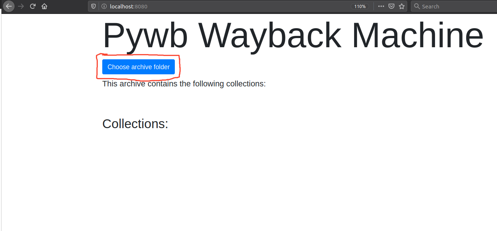
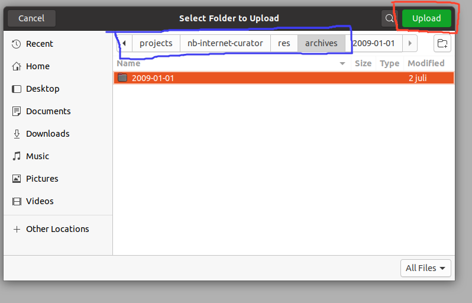
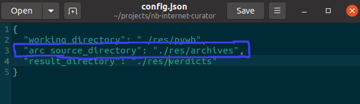
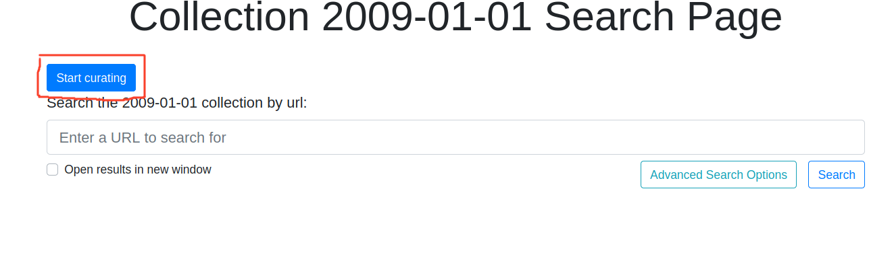
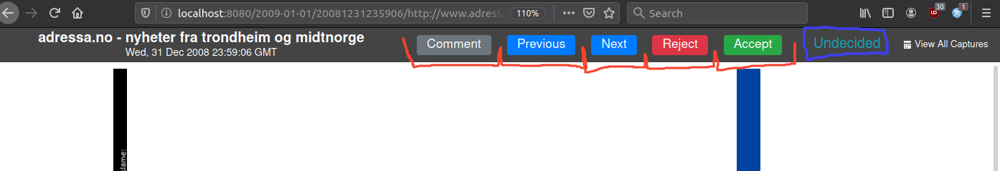

### english 

# How to use :open_book:
- Go to your pywb page in your browser (most likely localhost:8080)
- The first time this page will be mostly empty
- Click on the "Choose archive folder" button
 
- Navigate to you archive source directory and select upload on the archive you want to work with. It's important that the path in your directory selector and in your config match, otherwise the operation will fail.

    
    

- After you have selected an archive you should get a blue alert informing about the archive loading in. When the message dissapear, you should see it showing in the list. Otherwise you can refresh the page (f5)
- Unless you have gotten an error you should be able to see your new archive in the collections list. Click on it in the list 
- On the top of the collection page you should see a "Start curating" button. 
 
- When you access the first page you will see a panel with buttons at the top
 
 - You can now browse the page and decide if it is acceptable. If it is you press "Accept" and you will be taken to the next page.
 - You can also choose to "Reject" the page. This will mark the page as unsuitable for further usage. Pressing this page will also navigate you to the next page
 - Any page you browse can have a comment. To view previous comments you can press the comment button. You can also edit or submit a new comment on any page.
 - The status of the page is indicated in the right corner. Undecided means you have not given the page any verdict yet. Accepted means it is accepted, and rejected means rejected. This status can also be "Error" or "Irrelevant". Irrelevant means that the page is a resource or a sub-page of another page. Error means that an error has occured, and you should attempt to either refresh the page, or restart the python program. 