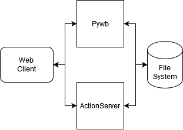

### Norwegian:
# Internet kurator
Dette er et internt verktøy for å gjøre kurator arbeid på nettsider som har blitt høstet av nasjonalbiblioteket.
 
# Installasjon
- klon oppbevaringskoden: ``git clone git@github.com:Rolv-Arild/nb-internet-curator.git``
- Generer et virtuelt miljø for prosjektet: ``python -m venv ./venv``
- Start miljøet i terminalen din
   - **Windows:** ``venv/Scripts/activate.bat``
   - **Linux:** ``source venv/Scripts/activate``
- Installer avhengighet: ``pip install -r requirements.txt``
- Kjør program: ``python main.py``

# Brukermanual :closed_book:
Gå til [manual](MANUAL-NO.md)

# Arkitektur

nb-internet-curator lener seg tungt på funksjonaliteten til pywb for å få til mest mulig med minst mulig kode.

Vi bruker template systemet til pywb for å utvide brukergrensesnittet.
Dette lar brukere hoppe rett til sider som er relevant, dømme de og gå videre med minst mulig bry.

Når en bruker tar i bruk den utvidede funksjonaliteten, så sendes handlingen til “ActionServer”. F.eks: bruker trykker på godkjenn knappen for å godkjenne en side.
Da sendes denne “eventen” til ActionServer som registrerer url og hvilken arc denne siden kom i fra til en metadata fil. Optimalt sett kan denne funksjonaliteten endres til å lagres i i.e en SQL database. 

 
 
 

### English:
# Internet curator
This is an internal tool for curating archived web pages at The National Library of Norway. 

# Installation
- Clone the repository: ``git clone git@github.com:Rolv-Arild/nb-internet-curator.git``
- Generate a virtual environment for the project: ``python -m venv ./venv``
- Source the environment in your terminal 
    - **Windows:** ``venv/bin/activate.bat``
    - **Linux:** ``source venv/bin/activate`` 
- Install dependencies: ``pip install -r requirements.txt``
- Run the program: ``python main.py``

# User manual :closed_book:
Go to the [manual](MANUAL-EN.md)
